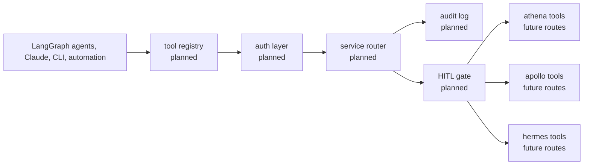

# ashton-mcp-gateway

The planned unified tool gateway for ASHTON.

> Current state: docs-first. The repo has planning, ADR, runbook, and
> growing-pains scaffolding, but no Go router, Rust rewrite path, MCP server,
> approval gate, or audit runtime has been authored yet.

That is the correct current state. The gateway only becomes valuable after the
service repos expose real surfaces worth routing. This README is meant to make
that future system legible without pretending it already exists.

## Planned Architecture

The standalone Mermaid source for this plan lives at
[`docs/diagrams/gateway-route-and-approval.mmd`](docs/diagrams/gateway-route-and-approval.mmd).

## Current Delivery State

| Area | Status | Notes |
| --- | --- | --- |
| README, roadmap, runbook, ADR, and growing-pains log | Instituted | The repo already has its planning spine |
| Go gateway implementation | Not started | This is the intended first executable version |
| MCP protocol surface | Not started | Deliberately deferred until the first service route is real |
| Tool registry and router | Not started | Depends on stable repo-local tool surfaces |
| Approval gate and audit runtime | Not started | Belongs after the first routed read call |
| Rust rewrite | Not started | Explicitly deferred until a real Go bottleneck exists |

## Technology And Delivery Plan

| Layer | Technology / Pattern | Status | Why |
| --- | --- | --- | --- |
| Documentation spine | Markdown READMEs, roadmap, runbook, ADR, growing pains | Instituted | Keeps the gateway concept structured before code exists |
| First implementation | Go | Planned | Fastest way to prove the pattern in the platform's primary language |
| Later rewrite path | Rust | Deferred | Earned only after measured routing or concurrency pressure exists |
| Protocol | MCP-compatible JSON-RPC over HTTP | Planned | Gives agent clients one standard discovery and call surface |
| Tool discovery | Static manifests from service repos and `ashton-proto` | Planned | Keeps service ownership explicit |
| Auth | Tailscale identity plus API keys | Planned | Interactive and automated callers need different trust paths |
| Audit trail | Postgres plus structured logs | Planned | Tool routing without audit would be a weak control layer |
| Approval path | Explicit human-in-the-loop gate | Planned | Required before real write actions are exposed |
| Rate limiting | Redis token bucket | Deferred | Useful later, not required for the first routed read call |

## Why This Repo Is Deferred

| Reason | Explanation |
| --- | --- |
| A gateway without tools is theater | The platform needs real service surfaces before a shared router means anything |
| Read routing must come before orchestration | The first useful proof is one discoverable, one routable read-only call |
| Approval logic should not be invented in a vacuum | Write gates make sense only after the read path is stable and trusted |
| Rust should be earned, not assumed | The Go-first decision is an engineering discipline choice, not a language hedge |

## First Real Slice

| In Scope | Out Of Scope |
| --- | --- |
| load one real manifest | broad multi-service orchestration |
| route one read-only tool call end to end | full write approval workflows |
| log who called what | rate limiting for traffic that does not exist yet |
| keep the path inspectable and debuggable | a Rust rewrite before the Go version exists |

## Planned Component Map

| Planned Component | Responsibility | State |
| --- | --- | --- |
| Tool registry | Discover and register tool manifests | Planned |
| Auth layer | Validate interactive and automated callers | Planned |
| Service router | Dispatch tool invocations to backend services | Planned |
| Approval gate | Hold write actions for explicit approval | Planned |
| Audit log | Track actor, tool, latency, input, output, and outcome | Planned |
| CLI | Manual operator inspection and test calls | Planned |
| Benchmark harness | Later justify or reject the Rust rewrite | Deferred |

## Go First, Rust Later

The repo already contains the correct architectural decision in
[`docs/adr/001-go-first-rust-later.md`](docs/adr/001-go-first-rust-later.md):
ship the first real gateway in Go, measure reality, then decide whether Rust is
actually warranted.

That choice is worth keeping visible because it signals restraint. The point of
this repo is not "show off multiple languages." The point is "build a useful
control layer only when the platform has earned one."

## Docs Map

- [Planned gateway diagram](docs/diagrams/gateway-route-and-approval.mmd)
- [Roadmap](docs/roadmap.md)
- [Growing pains](docs/growing-pains.md)
- [First-route runbook](docs/runbooks/first-route.md)
- [ADR 001: Go first, Rust later](docs/adr/001-go-first-rust-later.md)
- [ADR index](docs/adr/README.md)
- [Canonical repo brief](../ashton-platform/planning/repo-briefs/ashton-mcp-gateway.md)

## Why This Repo Matters

Structured honestly, the gateway repo shows the platform is being designed with
agent operations, approval control, and auditability in mind without faking
implementation maturity. That is a stronger story than a flashy stub that
claims the control plane already exists.
