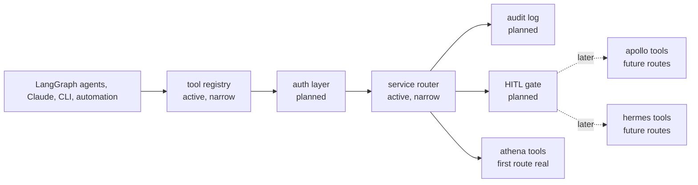

# ashton-mcp-gateway

The first executable tool gateway for ASHTON.

> Current real slice: one Go HTTP runtime that loads one manifest from
> `ashton-proto`, lists one registered tool, routes one read-only ATHENA
> occupancy call, and logs the path clearly. Nothing broader is claimed yet.

That is the correct current state. The gateway only became worth implementing
once the platform had real service truth to route. This README keeps the narrow
runtime honest while preserving the larger future control-plane shape.

## Status Legend

| Label | Meaning |
| --- | --- |
| `Shipped` | a git tag exists and represents the released repo line |
| `Unreleased on main` | the code and docs are present on `main`, but no matching git tag exists yet |
| `Planned` | documented future work only |

Current as of `2026-04-04`:

- latest shipped tag: `v0.0.1`
- current unreleased working line on `main`: `v0.1.0`
- next planned line after that: `v0.2.0`

## Current And Future Architecture

The standalone Mermaid source for the current and future view lives at
[`docs/diagrams/gateway-route-and-approval.mmd`](docs/diagrams/gateway-route-and-approval.mmd).

## Current Delivery State

| Area | Status | Notes |
| --- | --- | --- |
| README, roadmap, runbook, ADR, and growing-pains log | Instituted | The repo keeps the gateway scope readable |
| Go gateway implementation | Real, narrow | One HTTP runtime starts locally and loads static manifests |
| Health surface | Real | `GET /health` returns service status and manifest count |
| MCP-like list surface | Real | `POST /mcp/v1/tools/list` returns the registered tool metadata |
| First routed read-only call | Real | `POST /mcp/v1/tools/call` routes `athena.get_current_occupancy` |
| Inspectable read-path logs | Real | Success and upstream failure both emit bounded structured logs |
| Approval gate and persisted audit runtime | Not started | Deliberately deferred until later lines |
| Rust rewrite | Not started | Explicitly deferred until a real Go bottleneck exists |

## Technology And Delivery Plan

| Layer | Technology / Pattern | Status | Line | Why |
| --- | --- | --- | --- | --- |
| Documentation spine | Markdown READMEs, roadmap, runbook, ADR, growing pains | Instituted | `v0.0.1` | Keeps the gateway concept structured before code exists |
| First implementation | Go | Instituted | `v0.1.0` | Fastest way to prove the pattern in the platform's primary language |
| Protocol | narrow MCP-like JSON over HTTP | Instituted | `v0.1.0` | Enough to prove discovery and one routed call without pretending the full gateway is finished |
| Tool discovery | Static manifests from service repos and `ashton-proto` | Instituted | `v0.1.0` | Keeps service ownership explicit |
| Inspectable logs | structured read-path logs | Instituted | `v0.1.0` | The first route now logs tool, source, facility, latency, and outcome |
| Caller identity | Tailscale identity plus API keys | Planned | `v0.2.0` | Interactive and automated callers need different trust paths |
| Audit trail | Postgres plus structured logs | Planned | `v0.2.0` | Tool routing without persisted audit would be a weak control layer |
| Approval path | Explicit human-in-the-loop gate | Planned | `v0.3.0` | Required before real write actions are exposed |
| Rate limiting | Redis token bucket | Deferred | `v0.4.0` | Useful later, not required for the first routed read call |
| Later rewrite path | Rust | Deferred | later than `v0.4.0` | Earned only after measured routing or concurrency pressure exists |

## Why Build It Now

| Reason | Explanation |
| --- | --- |
| A gateway without tools is theater | The platform needed real service surfaces before a shared router meant anything |
| Read routing must come before orchestration | The first useful proof is one discoverable, one routable read-only call |
| Approval logic should not be invented in a vacuum | Write gates make sense only after the read path is stable and trusted |
| Rust should be earned, not assumed | The Go-first decision is an engineering discipline choice, not a language hedge |

## First Real Slice

The current release line is the authoritative boundary reminder.

| In Scope | Out Of Scope |
| --- | --- |
| load one real manifest | broad multi-service orchestration |
| route one read-only ATHENA occupancy call end to end | full write approval workflows |
| log the routed path clearly | rate limiting for traffic that does not exist yet |
| keep the path inspectable and debuggable | a Rust rewrite before the Go version exists |

## Runtime Surfaces

| Surface | Path | Status | Notes |
| --- | --- | --- | --- |
| Health | `GET /health` | Real | Returns service status and `manifests_loaded` |
| Tools list | `POST /mcp/v1/tools/list` | Real | Returns exactly the registered manifest-backed tool definitions |
| Tools call | `POST /mcp/v1/tools/call` | Real | Routes `athena.get_current_occupancy` through ATHENA's public occupancy endpoint |
| Manifest registry | `GATEWAY_MANIFEST_DIR` | Real | Loads `*.json` tool manifests from the configured directory |
| Read-path logs | stdout structured logs | Real | Emits `tool_name`, `source_service`, `facility_id`, `latency_ms`, and `outcome` |
| Approval or persisted audit runtime | - | Deferred | Tracer 9 does not widen into write control |

## Boundary Reminder

| The gateway should own | The gateway should not own |
| --- | --- |
| tool discovery and routing | domain truth for occupancy, members, or staff workflows |
| caller-facing read and later approval boundaries | service-specific business logic |
| auditability of routed calls | private copies of service data models |

## Current State Block

### Already real in this repo

- one Go HTTP runtime starts locally
- one manifest-backed tool registry loads from `GATEWAY_MANIFEST_DIR`
- `POST /mcp/v1/tools/list` returns exactly one registered tool:
  `athena.get_current_occupancy`
- `POST /mcp/v1/tools/call` validates `facility_id`, routes through ATHENA's
  public `GET /api/v1/presence/count`, and returns a structured source-backed
  result
- routed calls emit inspectable logs on both success and upstream failure

### Real but intentionally narrow

- only one tool exists
- only ATHENA is routable
- only read-only routing is implemented
- logs are inspectable but persisted audit storage is not real yet
- there is no caller identity, approval path, or rate limiting

### Deferred on purpose

- multi-service routing
- write governance
- persisted audit storage
- live deployment proof
- Rust rewrite

## Release History

| Release line | Exact tags | Status | What became real | What stayed deferred |
| --- | --- | --- | --- | --- |
| `v0.0.1` | `v0.0.1` | Shipped | docs-only planning baseline | executable runtime, manifests, routing, audit, approvals, and rate limiting |
| `v0.1.0` | - | Unreleased on `main` | executable Go runtime, first manifest-backed routed ATHENA occupancy read, and inspectable route logs | caller identity, persisted audit, approvals, and broader routing |

## Planned Release Lines

| Planned tag | Intended purpose | Restrictions | What it should not do yet |
| --- | --- | --- | --- |
| `v0.2.0` | caller identity plus persisted audit plus second routed read | keep the gateway read-only while adding stronger auditability | do not add write approvals yet |
| `v0.3.0` | first write approval and HITL line | add explicit human approval for write calls only after the read path is trusted | do not widen into rate limiting or full multi-service orchestration in the same line |
| `v0.4.0` | rate limiting and broader registry line | expand only after the gateway already has real read and write proof | do not justify a Rust rewrite without a measured Go bottleneck |

## Planned Component Map

| Planned Component | Responsibility | State |
| --- | --- | --- |
| Tool registry | Discover and register tool manifests | Real, narrow |
| Auth layer | Validate interactive and automated callers | Planned |
| Service router | Dispatch tool invocations to backend services | Real, narrow |
| Approval gate | Hold write actions for explicit approval | Planned |
| Audit log | Track actor, tool, latency, input, output, and outcome | Deferred; logs only today |
| CLI | Manual operator inspection and test calls | Deferred |
| Benchmark harness | Later justify or reject the Rust rewrite | Deferred |

## Go First, Rust Later

The repo already contains the correct architectural decision in
[`docs/adr/001-go-first-rust-later.md`](docs/adr/001-go-first-rust-later.md):
ship the first real gateway in Go, measure reality, then decide whether Rust is
actually warranted.

That choice is worth keeping visible because it signals restraint. The point of
this repo is not "show off multiple languages." The point is "build a useful
control layer only when the platform has earned one."

## Docs Map

- [Current and future gateway diagram](docs/diagrams/gateway-route-and-approval.mmd)
- [Roadmap](docs/roadmap.md)
- [Growing pains](docs/growing-pains.md)
- [First-route runbook](docs/runbooks/first-route.md)
- [ADR 001: Go first, Rust later](docs/adr/001-go-first-rust-later.md)
- [ADR index](docs/adr/README.md)
- [Canonical repo brief](../ashton-platform/planning/repo-briefs/ashton-mcp-gateway.md)

## Why This Repo Matters

Structured honestly, the gateway repo now shows the platform can route one
real, source-backed tool call without pretending the full control plane already
exists. That is a stronger story than a flashy stub or a speculative agent
platform claim.
