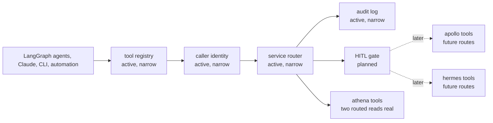

# ashton-mcp-gateway

The first executable tool gateway for ASHTON.

> Current real slice: one Go HTTP runtime that loads two shared manifests from
> `ashton-proto`, keeps `POST /mcp/v1/tools/list` open and narrow, requires
> explicit caller identity on `POST /mcp/v1/tools/call`, routes two read-only
> ATHENA occupancy reads, validates declared arguments strictly, rejects
> manifest path escapes, and persists sanitized audit rows to Postgres while
> keeping the line read-only. Nothing broader is claimed yet.

That is the correct current state. The gateway only became worth implementing
once the platform had real service truth to route. This README keeps the narrow
runtime honest while preserving the larger future control-plane shape.

## Status Legend

| Label | Meaning |
| --- | --- |
| `Shipped` | a git tag exists and represents the released repo line |
| `Working line` | the repo currently carries this line, but a matching tag may or may not exist yet |
| `Planned` | documented future work only |

Current as of `2026-04-10`:

- latest shipped tag: `v0.2.0`
- current working line on `main`: `v0.2.1`
- next planned line after that: `v0.3.0`

## Current And Future Architecture

The standalone Mermaid source for the current and future view lives at
[`docs/diagrams/gateway-route-and-approval.mmd`](docs/diagrams/gateway-route-and-approval.mmd).

## Current Delivery State

| Area | Status | Notes |
| --- | --- | --- |
| README, roadmap, runbooks, ADR, and growing-pains log | Instituted | The repo keeps the gateway scope readable |
| Go gateway implementation | Real, narrow | One HTTP runtime starts locally and loads static manifests |
| Health surface | Real | `GET /health` returns service status and manifest count |
| MCP-like list surface | Real, open and narrow | `POST /mcp/v1/tools/list` returns the registered tool metadata without widening into auth-platform work |
| Caller identity | Real, narrow | `POST /mcp/v1/tools/call` accepts trusted caller headers for internal callers and API keys for automation, with constant-time secret comparison |
| Persisted audit | Real, narrow | Routed calls persist sanitized audit rows to Postgres and fail closed if the audit write fails |
| Argument validation | Real, narrow | Routed calls reject undeclared arguments and wrong-type optional arguments before upstream routing |
| Manifest loading boundary | Real, narrow | The configured manifest directory rejects symlink escapes and non-regular manifest files |
| First routed read-only call | Real | `POST /mcp/v1/tools/call` routes `athena.get_current_occupancy` |
| Second routed read-only call | Real | `POST /mcp/v1/tools/call` routes `athena.get_current_zone_occupancy` |
| Inspectable read-path logs | Real | Success and routed failures emit bounded structured logs without leaking secrets |
| Approval gate | Not started | Deliberately deferred until `v0.3.0` |
| Rust rewrite | Not started | Explicitly deferred until a real Go bottleneck exists |

## Technology And Delivery Plan

| Layer | Technology / Pattern | Status | Line | Why |
| --- | --- | --- | --- | --- |
| Documentation spine | Markdown READMEs, roadmap, runbooks, ADR, growing pains | Instituted | `v0.0.1` | Keeps the gateway concept structured before code exists |
| Gateway runtime | Go | Instituted | `v0.1.0` -> `v0.2.0` | Fastest way to prove the pattern in the platform's primary language |
| Protocol | narrow MCP-like JSON over HTTP | Instituted | `v0.1.0` -> `v0.2.0` | Enough to prove discovery and routed calls without pretending the full gateway is finished |
| Tool discovery | Static manifests from one configured directory, currently `ashton-proto/mcp` | Real, narrow | `v0.1.0` -> `v0.2.1` | Keeps service ownership explicit while the runtime still supports only two manifest-backed ATHENA reads |
| Caller identity | trusted caller headers plus API keys | Real, narrow | `v0.2.0` -> `v0.2.1` | Interactive and automated callers need different trust paths without an auth-platform rewrite |
| Audit trail | Postgres plus structured logs | Real, narrow | `v0.2.0` -> `v0.2.1` | Tool routing without persisted audit would be a weak control layer |
| Approval path | Explicit human-in-the-loop gate | Planned | `v0.3.0` | Required before real write actions are exposed |
| Rate limiting | Redis token bucket | Deferred | `v0.4.0` | Useful later, not required for the read-only routed slice |
| Later rewrite path | Rust | Deferred | later than `v0.4.0` | Earned only after measured routing or concurrency pressure exists |

## Why Build It Now

| Reason | Explanation |
| --- | --- |
| A gateway without tools is theater | The platform needed real service surfaces before a shared router meant anything |
| Read routing must come before orchestration | The first useful proof is a small set of discoverable, routable read-only calls |
| Caller identity and audit should land before write governance | The next trust boundary is attribution and persistence, not writes |
| Rust should be earned, not assumed | The Go-first decision is an engineering discipline choice, not a language hedge |

## Current Release Line

The current release line is the authoritative boundary reminder.

| In Scope | Out Of Scope |
| --- | --- |
| load two real manifests | broad multi-service orchestration |
| keep `tools/list` open and narrow | full write approval workflows |
| require caller identity only on routed calls | auth-platform rewrite |
| persist sanitized audit for routed calls | rate limiting for traffic that does not exist yet |
| route two read-only ATHENA occupancy calls end to end | a Rust rewrite before the Go version earns it |

## Runtime Surfaces

| Surface | Path | Status | Notes |
| --- | --- | --- | --- |
| Health | `GET /health` | Real | Returns service status and `manifests_loaded` |
| Tools list | `POST /mcp/v1/tools/list` | Real, open and narrow | Returns exactly the registered manifest-backed tool definitions |
| Tools call | `POST /mcp/v1/tools/call` | Real, caller-aware | Requires explicit caller identity, bounded JSON decoding, and declared-argument validation before routing the supported read-only tool calls |
| Trusted caller identity | `X-Gateway-Trusted-Caller-Token`, `X-Gateway-Caller-Type`, `X-Gateway-Caller-Id`, optional `X-Gateway-Caller-Display` | Real, narrow | Intended for trusted internal boundaries only |
| Automated caller identity | `X-Gateway-API-Key` | Real, narrow | Intended for configured automation callers only |
| Manifest registry | `GATEWAY_MANIFEST_DIR` | Real | Loads `*.json` tool manifests from the configured directory and rejects symlink directory/file escapes |
| Audit store | `GATEWAY_AUDIT_DATABASE_URL` | Real | Persists sanitized audit rows for routed calls |
| Read-path logs | stdout structured logs | Real | Emits `tool_name`, `source_service`, routed arguments, `latency_ms`, and `outcome` without leaking secrets |

## Boundary Reminder

| The gateway should own | The gateway should not own |
| --- | --- |
| tool discovery and routing | domain truth for occupancy, members, or staff workflows |
| caller-facing read boundaries | service-specific business logic |
| auditability of routed calls | private copies of service data models |

## Current State Block

### Already real in this repo

- one Go HTTP runtime starts locally
- one manifest-backed tool registry loads from `GATEWAY_MANIFEST_DIR`
- `POST /mcp/v1/tools/list` returns exactly two registered tools:
  `athena.get_current_occupancy` and `athena.get_current_zone_occupancy`
- `POST /mcp/v1/tools/call` requires explicit caller identity and routes
  through ATHENA's public `GET /api/v1/presence/count`
- routed calls persist sanitized audit rows for success, unknown-tool, invalid-
  argument, and upstream-failure outcomes that cross the route boundary
- routed calls fail closed if the audit store is unavailable
- routed calls reject undeclared arguments and wrong-type optional arguments
  before they touch ATHENA
- tool-call request bodies are size-bounded and reject unknown top-level JSON
  fields
- trusted caller tokens and API keys are compared without direct string-equals
  shortcuts
- routed calls emit inspectable logs on both success and routed failure paths

### Real but intentionally narrow

- only ATHENA is routable
- only read-only routing is implemented
- caller identity is limited to trusted caller headers and configured API keys
- `tools/list` stays open and narrow while `tools/call` is the identity and
  audit boundary
- audit storage is real, but approval flow, rate limiting, and deployment proof
  are still deferred

### Deferred on purpose

- APOLLO or HERMES routed reads
- write governance
- live deployment proof
- Redis-backed rate limiting
- Rust rewrite

## Release History

| Release line | Exact tags | Status | What became real | What stayed deferred |
| --- | --- | --- | --- | --- |
| `v0.0.1` | `v0.0.1` | Shipped | docs-only planning baseline | executable runtime, manifests, routing, audit, approvals, and rate limiting |
| `v0.1.0` | - | Historical working line | executable Go runtime, first manifest-backed routed ATHENA occupancy read, and inspectable route logs | caller identity, persisted audit, approvals, and broader routing |
| `v0.2.0` | `v0.2.0` | Current Tracer 15 released line | caller identity, persisted audit, and a second routed ATHENA zone occupancy read | write approvals, rate limiting, live deployment proof, and broader routing |

## Versioning Discipline

The gateway now follows formal pre-`1.0.0` semantic versioning.

- `PATCH` releases cover hardening, docs sync, deployment closeout, observability,
  and bounded non-widening fixes
- `MINOR` releases cover new routed capabilities, new trust boundaries, or
  intentional pre-`1.0.0` contract changes
- pre-`1.0.0` breaking changes still require a `MINOR`, never a `PATCH`
- `1.0.0` is reserved for a stable routed control surface with legible identity,
  audit, and approval expectations

## Planned Release Lines

| Planned tag | Intended purpose | Restrictions | What it should not do yet |
| --- | --- | --- | --- |
| `v0.3.0` | first write approval and HITL line | add explicit human approval for write calls only after the read path is trusted | do not widen into rate limiting or full multi-service orchestration in the same line |
| `v0.4.0` | rate limiting and broader registry line | expand only after the gateway already has real read and write proof | do not justify a Rust rewrite without a measured Go bottleneck |

## Next Ladder Role

| Line | Role | Why it matters |
| --- | --- | --- |
| `v0.2.0` / `Tracer 15` | caller identity, persisted audit, and one second routed read | turns the gateway from a thin first route into a caller-aware and auditable control surface |
| `v0.3.0` | first write approval and HITL line | adds explicit write governance only after the read path is trusted |
| `v0.4.0` | broader registry and rate limiting | widens the control plane only after real read and write proof exist |

## Planned Component Map

| Planned Component | Responsibility | State |
| --- | --- | --- |
| Tool registry | Discover and register tool manifests | Real, narrow |
| Auth layer | Validate interactive and automated callers | Real, narrow |
| Service router | Dispatch tool invocations to backend services | Real, narrow |
| Approval gate | Hold write actions for explicit approval | Planned |
| Audit log | Track actor, tool, latency, sanitized input, and outcome | Real, narrow |
| CLI | Manual operator inspection and test calls | Deferred |
| Benchmark harness | Later justify or reject the Rust rewrite | Deferred |

## Go First, Rust Later

The repo already contains the correct architectural decision in
[`docs/adr/001-go-first-rust-later.md`](docs/adr/001-go-first-rust-later.md):
ship the first real gateway in Go, measure reality, then decide whether Rust is
actually warranted.

That choice is worth keeping visible because it signals restraint. The point of
this repo is not "show off multiple languages." The point is "build a useful
control layer only when the platform has earned one."

## Docs Map

- [Current and future gateway diagram](docs/diagrams/gateway-route-and-approval.mmd)
- [Roadmap](docs/roadmap.md)
- [Growing pains](docs/growing-pains.md)
- [Tracer 9 hardening](docs/hardening/tracer-9.md)
- [Tracer 15 hardening](docs/hardening/tracer-15.md)
- [First-route runbook](docs/runbooks/first-route.md)
- [Caller-aware audited routed reads runbook](docs/runbooks/caller-aware-audited-routed-reads.md)
- [ADR 001: Go first, Rust later](docs/adr/001-go-first-rust-later.md)
- [ADR index](docs/adr/README.md)
- [Canonical repo brief](../ashton-platform/planning/repo-briefs/ashton-mcp-gateway.md)

## Why This Repo Matters

Structured honestly, the gateway repo now shows the platform can route two
real, source-backed tool calls with explicit caller attribution and persisted
audit without pretending the full control plane already exists. That is a
stronger story than a flashy stub or a speculative agent platform claim.
